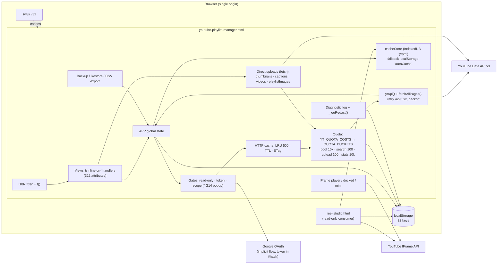

# Pass 1 — Architecture

> **Status (24/09/2026):** this report describes the code at `9c824eb` (app v1.27.3). Fixes since, errata and new findings: [`08-remediation.md`](08-remediation.md).

Base `origin/main` @ `9c824eb`, app **v1.27.3**. Read-only. The `engineering:architecture` skill is not installed in this session, so I applied the handoff's checklist by hand. Every `:N` reference without a file name points to `youtube-playlist-manager.html`.

## 1. Repository shape

| File | Lines | Role |
|---|---|---|
| `youtube-playlist-manager.html` | 15,457 | The whole app: CSS l.22–1321, HTML l.1323–2759, JS l.2760–15454, all in one file |
| `reel-studio.html` | 1,786 | Second UI ("music" skin) that only **reads** the app's cache (IndexedDB `ytpm` + legacy `autoCache`) and plays through the IFrame API. **It makes no Data API call** (0 `ytApi`/`fetch` to googleapis). |
| `tests.html` | 3,041 | Same-origin regression harness: loads the app in an iframe and calls its globals |
| `sw.js` | 85 | Service worker `reel-manager-v32` |
| `how-it-works.html`, `quota-estimator.html` | 323 / 1,011 | Standalone marketing/tooling pages; not linked into the app's runtime |
| `index.html`, `manifest.json`, `icons/`, `LANCER-APP.bat` | — | Redirect to the app, PWA manifest, Windows launcher (`python -m http.server`) |

There is no build step, package manager, backend or server code in the repo.

## 2. Logical modules of the monolith

Located by the file's own `// ====` section banners. Sizes are approximate line spans.

| Module | Location | ~Lines | Responsibility | Main state it owns |
|---|---|---|---|---|
| Constants | :2763–2771 | 10 | `API_BASE`, OAuth scopes | `currentScope` |
| **i18n** | :2772–4373 | 1,600 | `I18N.fr` (:2775) / `I18N.en` (:3553), `t()` :4334, `applyLanguage()` :4342 | `currentLang` (`appLang`) |
| **APP state** | :4374–4409 | 35 | Single global object `APP` (:4376): token, quota, playlists, `allVideos`, tags, folders, deck, queue, bookmarks, read-only flag | Hydrated from ~10 localStorage keys at parse time |
| **Diagnostic log** (#66) | :4410–4850, :15426+ | 440 | `log()` :4645, `_logRedact()` :4692, `persistLog()` :4730, global error capture | `APP.log`, `diagnosticLog` |
| Read-only mode (#43) | :4851–4889 | 40 | Blocks writes app-wide | `readOnlyMode` |
| Bookmarks (#63) + channel system playlists (#68) | :4890–5165 | 275 | External playlists by id, `UUSH`/`UULF` | `bookmarkedPlaylists` |
| **Quota** (#76) | :5166–5405, :6115–6217 | 350 | Cost table `YT_QUOTA_COSTS` :5175, buckets :5232, limits :5239, `chargeQuota()` :5273, Pacific reset :5291/:5303, persistence :5340–5391, pre-flight `estimateQuotaCost()`/`checkQuotaBudget()` :6159/:6189 | `APP.quota`, `quotaState`, `apiCalls`, `quotaResetDate` |
| **Retry/backoff** | :5393–5421 | 30 | `RETRY_CONFIG`, full-jitter backoff, `Retry-After` parsing | — |
| **HTTP response cache** | :5425–5520 | 95 | In-memory LRU `API_CACHE` (500 entries, 250 KB/body), TTL per endpoint, ETag, `invalidateCacheForWrite()` :5495 | `API_CACHE` (not persisted) |
| **Init & auth** | :5526–5655, :6218–6263, :6559–6730 | 330 | `init()` :5532, cache-first display, implicit-flow OAuth `buildAuthUrl()` :6584 (`response_type=token`), `checkAuth()` :6682, #G14 popup :6613–6680, scope upgrade | `APP.accessToken` (memory only), `tokenExpiresAt` (sessionStorage) |
| **Persistent cache store** (#G11) | :5656–6114 | 460 | IndexedDB `ytpm` (stores `playlists`/`videos`/`meta`) with a localStorage fallback, legacy migration, `loadBackupFromStorage()` :5889 | IDB `ytpm`, `autoCache` |
| GDPR (#8/CR5) | :6264–6329 | 65 | `deleteAllUserData()` :6266, `checkAutoPurge()` :6302 | — |
| Theme / skin / picker | :6731–7289 | 560 | Named themes, accents, colour picker, skins | `appTheme`, `appSkin`, `appNamedTheme`, `themeAccents`, `customAccent` |
| **`ytApi` core** | :7290–7555 | 265 | `ytApi()` :7302 (gates → cache → charge → fetch/retry → error map → invalidate/cache), `fetchAllPages()` :7517 | — |
| **Data loading** | :7556–7950 | 395 | `showApp()` :7570, `autoSaveCache`, `loadAllPlaylists()` :7854, `loadPlaylistVideos()` :7881, `getVideoDetails()` :7915 | `APP.playlists`, `APP.allVideos`, `videoDetailsCache` |
| Dashboard + Trending (#81) | :7951–8390 | 440 | Stats tiles, `loadTrending()` | `trendingCategory` |
| **Player** | :8391–8865 | 475 | IFrame API player, queue, like (#I3), docked mode, #B12 pause :8427–8428 | `PLAYER`, `watchQueue` |
| Beta registry | :8866–8968 | 100 | Feature flags UI | — |
| **Studio Creator** | :8969–9436 | 470 | Video metadata, thumbnails, captions, channel branding, **video upload** | — |
| View switching | :9437–9494 | 60 | `switchView()` :9439 | — |
| Playlists + detail + filters + covers (#I1) + Shorts + **Music Mode** | :9495–10682 | 1,190 | List, detail, filters, `pickThumb()` :9827, covers :9884–10100, `detectShort()` :10114, `musicScore()` :10236, `parseArtistTitle()` :10319, `classifyVideoType()` :10356 | `playlistViewMode`, `reelMusicMode`, `libraryLens` |
| Reorder | :10683–11028 | 345 | Drag & drop `playlistItems.update`, create/rename/delete playlist | — |
| Search + recent | :11029–11332 | 300 | Global local search | `recentSearches` |
| **Discover** | :11333–12138 | 805 | `search.list`, stats (`batchGetStats`), entity search (#82), create playlist from results | `discoverFilters` |
| Merge / Move | :12139–12471 | 330 | `performMerge()` :12172, `performMove()` :12410 | — |
| Ghosts / Duplicates | :12476–12695 | 220 | Detection + deletion | — |
| Stats charts | :12696–12822 | 125 | SVG charts | — |
| Tags / icons / auto-categorize | :12823–13005, :13600–13800 | 380 | Tags, auto-categorize (v1.27.3) | `playlistTags`, `tagIcons` |
| Folders | :13006–13311 | 305 | Playlist folders | `playlistFolders`, `folderAssignments`, `folderExpanded` |
| Deck | :13312–13799 | 490 | Multi-column view | `deckColumns` |
| Watch plan | :13800–14045 | 245 | Queue builder | `watchQueue` |
| Subscriptions (#I2) | :14046–14280 | 235 | List / subscribe / unsubscribe | `APP.subscriptions` |
| Playlist diff / bulk rename | :14281–14424 | 145 | — | — |
| **Backup & restore** | :14425–14972 | 550 | `createBackup()` :14427, JSON/CSV parse :14580–14691, `executeRestore()` :14755 (pause/resume/cancel) | `lastBackup`, `lastBackupTimestamp` |
| **Export** (CSV, transfer preset #18) | :14973–15171 | 200 | `escapeHtml()` :14961, CSV + formula guard, `TRANSFER_CSV_HEADERS` :15031 | — |
| Helpers / charts / shortcuts / boot / SW registration | :15172–15454 | 280 | `showToast`, `parseDuration`, SW register :15402 | — |

**Observations**

- **A1 — Everything is global.** 32 localStorage keys, one `APP` object, and module-level `let` state (`videoDetailsCache`, `currentDetailVideos`, `moveVideosCache`, `musicMode`, `PLAYER`…). Section banners are the only module boundary. Ordering is fragile: :5521 carries the comment `// Video details cache — MUST be declared before loadBackupFromStorage() to avoid TDZ`.
- **A2 — The HTML is the event bus.** 322 inline `on*="…"` attributes call globals by name. That is why the CSP keeps `'unsafe-inline'` (see AUD-02), and it is the main obstacle to splitting the file into ES modules.
- **A3 — Two UIs share one storage contract with no schema version on the IDB payload** beyond `CACHE_DB_VERSION = 1` (:5673). Reel Studio re-implements `pickThumb`, the colour picker and theme code (`reel-studio.html:631–849`, `:920`) instead of sharing them. That is duplication, covered in Pass 4.
- **A4 — The quota counter is per browser, not per Google Cloud project.** `APP.quota` lives in `localStorage` (:5340 `saveQuotaState`), while Google's 10,000-unit pool is per **client ID**. Several devices, or several users sharing a client ID, each see only their own share. The counter is a local estimate, not the real ceiling. That is expected for a client-only app and is exactly what Phase 4's proxy has to fix. « non vérifié » how the UI words this to users.

## 3. Request pipeline (`ytApi`, :7302–7514)

1. **Gates.** Read-only mode blocks writes (:7305). No token blocks writes and prompts reconnect (:7315, #B14). Readonly scope + write triggers `ensureWriteScope()` (popup, #G14) (:7319).
2. **URL build** from `API_BASE/endpoint` + params (:7333). The cache key is the full URL.
3. **Fresh cache hit** (TTL per endpoint, :5436–5459): return with no network and no quota (:7343).
4. **Conditional headers.** GET + cached ETag sends `If-None-Match`. PUT/DELETE + cached ETag sends `If-Match` (:7363–7372).
5. **Quota charged once, before the request** (:7379–7383), via `chargeQuota()` into the endpoint's bucket.
6. **Fetch with up to 3 retries.** Network errors, 429 (`Retry-After`, capped at 60 s) and 5xx get full-jitter backoff (:7393–7446). 304 refreshes the cache entry. 412 evicts it and throws.
7. **Error mapping.** 403 splits into quotaExceeded / not registered / session expired (:7454–7469). 401 means session expired. Anything else throws the API message.
8. **Success.** Writes call `markDirty()` + `invalidateCacheForWrite()`. GETs with an ETag are cached (:7479–7503).
9. `fetchAllPages()` (:7517) loops `ytApi` with `maxResults=50`, up to `maxPages` (default 20). The first-page error propagates, later ones keep a partial result.

Four direct `fetch` uploads bypass `ytApi` and charge `chargeQuota()` themselves **after** success: thumbnails (:9201), captions (:9275), video resumable upload (:9410), playlist cover (:10027). Two non-quota Google calls: userinfo (:7829), token revoke (:6273).

## 4. Every YouTube API call site, with cost and bucket

Cost and bucket come from `YT_QUOTA_COSTS` (:5175) and `QUOTA_BUCKETS` (:5232). The **Pre-flight** column says whether a `checkQuotaBudget()` runs before the call (callers at :8235, 9132, 9177, 9254, 9319, 9350, 10071, 10761, 10960, 11007, 11795, 12190, 12420, 12543, 14387).

### Reads

| Endpoint | Cost | Bucket | Call sites (function :line) | Paging | Pre-flight |
|---|---|---|---|---|---|
| `playlists.list` (mine) | 1/page | pool | `loadAllPlaylists` :7857 | ≤20 pages | — |
| `playlists.list` (by id) | 1 | pool | `addBookmark` :4959, `fetchBookmarkedMetadata` :5115, `fillDiscoverPlaylistCounts` :11388 | — | — |
| `playlists.list` (channelId) | 1/page | pool | `browseChannelPlaylists` :11489 | **≤20 pages** (AUD-01) | ❌ |
| `playlistItems.list` | 1/page | pool | `loadPlaylistVideos` :7900 (+ retry without `fields=` :7909), `loadDeckColumnVideos` :13531, `loadDeckFolderVideos` :13551; indirectly auto-categorize :13690, duplicates scan :12588, ghosts scan :12483, channel system playlists | ≤20 pages each | ❌ (auto-categorize: tracked as **#78**) |
| `videos.list` (details) | 1 per 50 ids | pool | `getVideoDetails` :7931 (parts `contentDetails,snippet,topicDetails,player`) | batches of 50 | — |
| `videos.list` (snippet, thumbnails) | 1 per 50 | pool | `loadSearchThumbnails` :11201, `loadMoveThumbnails` :12334, `loadDupeThumbnails` :12661 | batches | — |
| `videos.list` (Studio) | 1 | pool | `onStudioVideoSelect` :9112 | — | — |
| `videos.list` chart=mostPopular | 1 | pool | `loadTrending` :8128 | — | — |
| `videos.list` (Discover details) | 1 | pool | `performDiscoverSearch` :11855 | — | — |
| `videos.list` statistics (fallback) | 1 | pool | `fetchVideoStats` :11593 | — | — |
| `videos:batchGetStats` | 1 | **stats** (10,000) | `fetchVideoStats` :11580 | — | — |
| `videos/getRating` | 1 | pool | `fetchRating` :8594 | — | — |
| `search.list` | 1 **call** | **search** (100 calls) | `performDiscoverSearch` :11835, `performDiscoverEntitySearch` :11361 | user-chosen pages | ✅ :11795 (search bucket) |
| `subscriptions.list` | 1/page | pool | `loadSubscriptions` :14051, `probeSubscription` :14188 | ≤20 pages | — |
| `captions.list` | **50** | pool | `loadCaptionsList` :9218 | — | ❌ |
| `channels.list` | 1 | pool | `loadChannelInfo` :9301 | — | — |
| `playlistImages.list` | 1 | pool | `loadPlaylistCover` :9914 | — | — |
| `videoCategories.list` | 1 | pool | `loadVideoCategories` :13621 | — | — |
| `oauth2/v2/userinfo` | 0 (not Data API) | — | `loadUserInfo` :7829 | — | — |

### Writes

| Endpoint | Cost | Bucket | Call sites | Pre-flight |
|---|---|---|---|---|
| `playlistItems.insert` | 50 | pool | `confirmAddTrending` :8238, `createPlaylistFromDiscover` :12090, `performMerge` :12217, `performMove` :12434, `executeRestore` :14878 | ✅ except restore (own estimator `updateRestoreQuota` :14719, « non vérifié » whether it blocks) |
| `playlistItems.update` | 50 | pool | `onVideoDrop` (reorder) :10766 | ✅ |
| `playlistItems.delete` | 50 | pool | `performMove` :12447, `removeGhostVideo` :12514, `removeDuplicateFromPlaylist` :12568 | ✅ move / bulk ghosts; ❌ single ghost, duplicate |
| `playlists.insert` | 50 | pool | `createPlaylist` :10851, `createPlaylistFromDiscover` :12078, `performMerge` :12198, `executeRestore` :14843 | partial |
| `playlists.update` | 50 | pool | `renamePlaylist` :10936, `applyRenames` :10966, `performBulkRename` :14407 | ✅ except single rename |
| `playlists.delete` | 50 | pool | `deletePlaylist` :11016 | ✅ :11007 |
| `playlistImages.insert/update` (multipart `fetch`) | 50 | pool | `uploadPlaylistCover` :10015 | ✅ :10071 |
| `playlistImages.delete` | 50 | pool | `removePlaylistCover` :10043 | — |
| `videos.rate` | 50 | pool | `togglePlayerLike` :8644 | — |
| `videos.update` | 50 | pool | `saveVideoMetadata` :9144 | ✅ :9132 (estimator key missing, see Pass 3) |
| `thumbnails.set` (`fetch`) | 50 | pool | `uploadThumbnail` :9188 | ✅ :9177 (same) |
| `captions.insert` (`fetch`) | **400** | pool | `uploadCaption` :9265 | ✅ :9254 (same) |
| `captions.delete` | 50 | pool | `deleteCaption` :9290 | — |
| `channels.update` | 50 | pool | `saveChannelInfo` :9326 | ✅ :9319 (same) |
| `videos.insert` (resumable `fetch`) | 1 **call** | **upload** (100 calls) | `uploadVideo` :9370 | ✅ :9350 but on the **pool** bucket (default arg) — Pass 3 |
| `subscriptions.insert` | 50 | pool | `subscribeToChannel` :14202 | estimator key exists (:6178), « non vérifié » caller |
| `subscriptions.delete` | 50 | pool | `toggleSubscription` :14224, `unsubscribeChannel` :14269 | — |
| OAuth revoke | 0 | — | `deleteAllUserData` :6273 | — |

Total: **58 call sites across 18 Data API methods**, 4 direct uploads, 2 non-quota Google calls. `reel-studio.html` makes none.

## 5. Data flows

**Boot** (`init()` :5532): popup short-circuit (#G14), then auto-purge check, capture `?bookmark=`, theme, log restore, IDB legacy migration, `loadBackupFromStorage()` (IDB → `APP.playlists`/`APP.allVideos`/`videoDetailsCache`), quota restore + Pacific reset, language. If cached data exists, `showAppFromCache()` renders with **0 API calls**. Last comes `checkAuth()`, which reads `#access_token` from the hash, clears the hash and calls `showApp()`. `showApp()` loads userinfo and uses the cache if present, otherwise runs `loadAllPlaylists()` → `loadPlaylistVideos()` per playlist → `getVideoDetails()` → `autoSaveCache()` into IDB.

**Write** (e.g. Move): UI → `checkBackupSafety()` → `checkQuotaBudget()` → `ytApi` POST/DELETE → `invalidateCacheForWrite()` (HTTP cache) + `delete APP.allVideos[id]` (model cache) → re-render → `markDirty()` → auto-save.

**Backup**: `createBackup()` builds JSON (or CSV) from `APP` and downloads it, stamping `lastBackup*`. Restore goes `parseRestoreFile()` → per-playlist selection → `executeRestore()`, which recreates playlists and items via `ytApi`, with pause/resume/cancel.

**Studio link**: the app writes the IDB/`autoCache` and Reel Studio reads it (`reel-studio.html:936 readCacheFromIDB`). There's no messaging between the two. The links are version-stamped (:6767 `updateVersionLinks`).

**Service worker**: HTML is network-first, static assets cache-first with background refresh, Google/YouTube hosts are pass-through. The pre-cache list names only the main app (`sw.js:8–13`), not `reel-studio.html`. Staleness risk → Pass 3.

## 6. Gap to the Phase 4 SaaS target (Node/Express proxy, PostgreSQL, Redis)

The backlog (v6.5 l."Pending items — Phase 4 commercial") names the target: backend quota proxy with rate limiting, cache and per-user queue (#1p2-3), plus AI endpoints on the KVM2 VPS (#H1–#H3), Stripe and store publication. Today **nothing server-side exists**. What each client module becomes:

| Client module today | Phase 4 destination | Coupling that makes it hard | Order |
|---|---|---|---|
| OAuth implicit flow, token in memory (:6584, :6682) | **Express**: auth-code + PKCE + `state` (#G6), refresh token held server-side, HTTP-only session cookie | Every `ytApi` call builds its own `Authorization: Bearer` header. `checkAuth` trusts any `#access_token`. | **1** (unblocks everything; also #G6, gated by #75 naming) |
| `ytApi` + retry + error mapping (:7302) | **Express proxy** `/api/yt/*`: the same pipeline server-side. The client `ytApi` becomes a thin `fetch('/api/yt/…')` with the same signature. | Signature `ytApi(endpoint, params, method, body)` is already a clean seam. Keep it and swap the body. | **2** |
| Quota model `YT_QUOTA_COSTS` / `QUOTA_BUCKETS` / `chargeQuota` (:5175–5277) | **Redis** counters per project + per user, per bucket, Pacific-day keys, atomic `INCRBY`. Pre-flight becomes a server check. | Pure functions that are already isolated and tested. Extract them as-is into a shared module. | **2** (with the proxy) |
| HTTP cache `API_CACHE` (:5433) | **Redis** response cache keyed by URL + user, ETag kept | Invalidation (`invalidateCacheForWrite`) is substring matching on URLs (:5510–5516) and needs a real key scheme. | 3 |
| `cacheStore` IDB + backup JSON (:5656, :14427) | **PostgreSQL**: `playlists`, `playlist_items`, `video_details`, `tags`, `folders`, `bookmarks`. IDB stays as the offline cache. | Backup JSON is the de-facto schema and has no version field (« non vérifié », Pass 2). Define the SQL schema from it. | 4 |
| Tags, folders, deck, watch queue, bookmarks (localStorage) | **PostgreSQL** per user (sync across devices) | Read at parse time into `APP` (:4376–4405) | 4 |
| Diagnostic log | Server log + client ring buffer | `_logRedact` must stay client-side too | 5 |
| Auto-categorize, Music scoring, Shorts detection | Can stay client-side (pure, no quota) or move to workers (Bull/Redis queue, #H3) for AI features | Pure functions → easy | 6 |
| #68 HEAD fallback (not shipped) | Only feasible server-side | CORS | with proxy |
| i18n, themes, player, views | Stay client-side | Inline handlers (A2) block a module split but not the backend | independent track |

**Recommended extraction order:**
1. Pull the pure modules (quota tables, `normalizeEndpoint`, `getQuotaCost`, `parseDuration`, `musicScore`, `parseArtistTitle`, `detectShort`, CSV escaping) into a shared ES module used by both the page and `tests.html`. Zero behaviour change.
2. Build the auth-code + PKCE server, then the proxy behind the existing `ytApi` signature.
3. Move quota and cache to Redis.
4. Move user data to PostgreSQL with IDB as the offline mirror.
5. Add queues/AI.

The inline-handler refactor (AUD-02) runs in parallel. It is a prerequisite for a strict CSP, not for the backend.

## 7. Items noted here for later passes (not yet findings)

- Quota is charged **before** the request (:7380) in `ytApi`, but only **after success** for direct uploads. The rules are inconsistent → Pass 3.
- `fetchAllPages` default of 20 pages = 1,000 items, used by `loadPlaylistVideos` (:7900) with no override. YouTube playlists go up to 5,000 → Pass 3.
- `If-Match` is looked up with the write URL's cache key → Pass 3.
- The `videos.insert` pre-flight is checked against the pool bucket; several `estimateQuotaCost` keys are missing → Pass 3.
- `checkAuth` accepts any `#access_token` with no `state` (#G6) → Pass 2.
