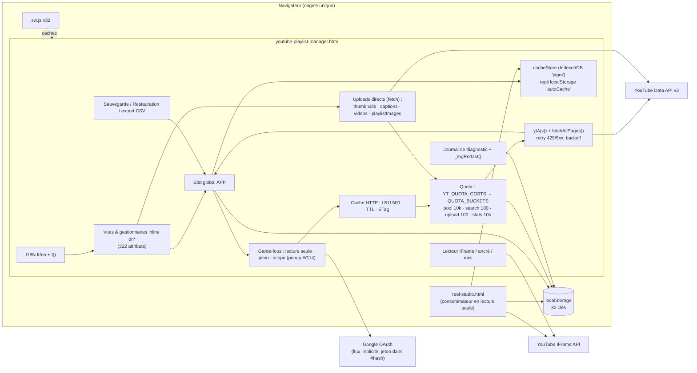

# Passe 1 — Architecture

> **État (24/09/2026) :** ce rapport décrit le code à `9c824eb` (app v1.27.3). Correctifs depuis, errata et nouveaux constats : [`08-remediation.md`](08-remediation.md).

> Traduction française de [`../01-architecture.md`](../01-architecture.md). En cas d'écart, la version anglaise fait foi pour les extraits de code.

Base `origin/main` @ `9c824eb`, app **v1.27.3**. Lecture seule. Le skill `engineering:architecture` n'est pas installé dans cette session : j'ai donc appliqué à la main la checklist du handoff. Toute référence `:N` sans nom de fichier désigne `youtube-playlist-manager.html`.

## 1. Structure du dépôt

| Fichier | Lignes | Rôle |
|---|---|---|
| `youtube-playlist-manager.html` | 15 457 | L'app entière : CSS l.22–1321, HTML l.1323–2759, JS l.2760–15454, le tout dans un seul fichier |
| `reel-studio.html` | 1 786 | Seconde UI (habillage « musique ») qui se contente de **lire** le cache de l'app (IndexedDB `ytpm` + ancien `autoCache`) et lit les vidéos via l'IFrame API. **Elle ne fait aucun appel à la Data API** (0 `ytApi`/`fetch` vers googleapis). |
| `tests.html` | 3 041 | Harnais de régression de même origine : charge l'app dans une iframe et appelle ses globales |
| `sw.js` | 85 | Service worker `reel-manager-v32` |
| `how-it-works.html`, `quota-estimator.html` | 323 / 1 011 | Pages autonomes de présentation/outillage ; non reliées à l'exécution de l'app |
| `index.html`, `manifest.json`, `icons/`, `LANCER-APP.bat` | — | Redirection vers l'app, manifeste PWA, lanceur Windows (`python -m http.server`) |

Le dépôt ne contient ni étape de build, ni gestionnaire de paquets, ni backend, ni code serveur.

## 2. Modules logiques du monolithe

Repérés grâce aux bannières de section `// ====` du fichier lui-même. Les tailles sont des étendues de lignes approximatives.

| Module | Emplacement | ~Lignes | Responsabilité | Principal état détenu |
|---|---|---|---|---|
| Constantes | :2763–2771 | 10 | `API_BASE`, scopes OAuth | `currentScope` |
| **i18n** | :2772–4373 | 1 600 | `I18N.fr` (:2775) / `I18N.en` (:3553), `t()` :4334, `applyLanguage()` :4342 | `currentLang` (`appLang`) |
| **État APP** | :4374–4409 | 35 | Objet global unique `APP` (:4376) : jeton, quota, playlists, `allVideos`, tags, dossiers, deck, file d'attente, favoris, indicateur lecture seule | Hydraté depuis ~10 clés localStorage au moment du parsing |
| **Journal de diagnostic** (#66) | :4410–4850, :15426+ | 440 | `log()` :4645, `_logRedact()` :4692, `persistLog()` :4730, capture globale des erreurs | `APP.log`, `diagnosticLog` |
| Mode lecture seule (#43) | :4851–4889 | 40 | Bloque les écritures dans toute l'app | `readOnlyMode` |
| Favoris (#63) + playlists système de chaîne (#68) | :4890–5165 | 275 | Playlists externes par id, `UUSH`/`UULF` | `bookmarkedPlaylists` |
| **Quota** (#76) | :5166–5405, :6115–6217 | 350 | Table des coûts `YT_QUOTA_COSTS` :5175, buckets :5232, limites :5239, `chargeQuota()` :5273, reset Pacifique :5291/:5303, persistance :5340–5391, pré-vol `estimateQuotaCost()`/`checkQuotaBudget()` :6159/:6189 | `APP.quota`, `quotaState`, `apiCalls`, `quotaResetDate` |
| **Retry/backoff** | :5393–5421 | 30 | `RETRY_CONFIG`, backoff à jitter complet, lecture de `Retry-After` | — |
| **Cache des réponses HTTP** | :5425–5520 | 95 | LRU en mémoire `API_CACHE` (500 entrées, 250 KB/corps), TTL par endpoint, ETag, `invalidateCacheForWrite()` :5495 | `API_CACHE` (non persisté) |
| **Init & auth** | :5526–5655, :6218–6263, :6559–6730 | 330 | `init()` :5532, affichage depuis le cache en priorité, OAuth en flux implicite `buildAuthUrl()` :6584 (`response_type=token`), `checkAuth()` :6682, popup #G14 :6613–6680, élévation de scope | `APP.accessToken` (en mémoire uniquement), `tokenExpiresAt` (sessionStorage) |
| **Stockage persistant du cache** (#G11) | :5656–6114 | 460 | IndexedDB `ytpm` (stores `playlists`/`videos`/`meta`) avec repli localStorage, migration de l'ancien format, `loadBackupFromStorage()` :5889 | IDB `ytpm`, `autoCache` |
| RGPD (#8/CR5) | :6264–6329 | 65 | `deleteAllUserData()` :6266, `checkAutoPurge()` :6302 | — |
| Thème / habillage / sélecteur | :6731–7289 | 560 | Thèmes nommés, accents, sélecteur de couleur, habillages | `appTheme`, `appSkin`, `appNamedTheme`, `themeAccents`, `customAccent` |
| **Cœur `ytApi`** | :7290–7555 | 265 | `ytApi()` :7302 (garde-fous → cache → facturation → fetch/retry → mappage des erreurs → invalidation/mise en cache), `fetchAllPages()` :7517 | — |
| **Chargement des données** | :7556–7950 | 395 | `showApp()` :7570, `autoSaveCache`, `loadAllPlaylists()` :7854, `loadPlaylistVideos()` :7881, `getVideoDetails()` :7915 | `APP.playlists`, `APP.allVideos`, `videoDetailsCache` |
| Tableau de bord + Tendances (#81) | :7951–8390 | 440 | Tuiles de statistiques, `loadTrending()` | `trendingCategory` |
| **Lecteur** | :8391–8865 | 475 | Lecteur IFrame API, file d'attente, like (#I3), mode ancré, pause #B12 :8427–8428 | `PLAYER`, `watchQueue` |
| Registre bêta | :8866–8968 | 100 | UI des feature flags | — |
| **Studio Creator** | :8969–9436 | 470 | Métadonnées vidéo, miniatures, sous-titres, branding de chaîne, **upload de vidéo** | — |
| Changement de vue | :9437–9494 | 60 | `switchView()` :9439 | — |
| Playlists + détail + filtres + couvertures (#I1) + Shorts + **Mode Musique** | :9495–10682 | 1 190 | Liste, détail, filtres, `pickThumb()` :9827, couvertures :9884–10100, `detectShort()` :10114, `musicScore()` :10236, `parseArtistTitle()` :10319, `classifyVideoType()` :10356 | `playlistViewMode`, `reelMusicMode`, `libraryLens` |
| Réordonnancement | :10683–11028 | 345 | Glisser-déposer `playlistItems.update`, créer/renommer/supprimer une playlist | — |
| Recherche + récentes | :11029–11332 | 300 | Recherche locale globale | `recentSearches` |
| **Discover** | :11333–12138 | 805 | `search.list`, statistiques (`batchGetStats`), recherche d'entités (#82), création de playlist depuis les résultats | `discoverFilters` |
| Fusion / Déplacement | :12139–12471 | 330 | `performMerge()` :12172, `performMove()` :12410 | — |
| Fantômes / Doublons | :12476–12695 | 220 | Détection + suppression | — |
| Graphiques de statistiques | :12696–12822 | 125 | Graphiques SVG | — |
| Tags / icônes / auto-catégorisation | :12823–13005, :13600–13800 | 380 | Tags, auto-catégorisation (v1.27.3) | `playlistTags`, `tagIcons` |
| Dossiers | :13006–13311 | 305 | Dossiers de playlists | `playlistFolders`, `folderAssignments`, `folderExpanded` |
| Deck | :13312–13799 | 490 | Vue multicolonne | `deckColumns` |
| Plan de visionnage | :13800–14045 | 245 | Constructeur de file d'attente | `watchQueue` |
| Abonnements (#I2) | :14046–14280 | 235 | Lister / s'abonner / se désabonner | `APP.subscriptions` |
| Diff de playlists / renommage en masse | :14281–14424 | 145 | — | — |
| **Sauvegarde & restauration** | :14425–14972 | 550 | `createBackup()` :14427, parsing JSON/CSV :14580–14691, `executeRestore()` :14755 (pause/reprise/annulation) | `lastBackup`, `lastBackupTimestamp` |
| **Export** (CSV, préréglage transfert #18) | :14973–15171 | 200 | `escapeHtml()` :14961, CSV + protection contre les formules, `TRANSFER_CSV_HEADERS` :15031 | — |
| Helpers / graphiques / raccourcis / démarrage / enregistrement du SW | :15172–15454 | 280 | `showToast`, `parseDuration`, enregistrement du SW :15402 | — |

**Observations**

- **A1 — Tout est global.** 32 clés localStorage, un objet `APP`, et un état `let` au niveau module (`videoDetailsCache`, `currentDetailVideos`, `moveVideosCache`, `musicMode`, `PLAYER`…). Les bannières de section sont la seule frontière entre modules. L'ordre est fragile : :5521 porte le commentaire `// Video details cache — MUST be declared before loadBackupFromStorage() to avoid TDZ`.
- **A2 — Le HTML sert de bus d'événements.** 322 attributs inline `on*="…"` appellent des globales par leur nom. C'est pour cela que la CSP garde `'unsafe-inline'` (voir AUD-02), et c'est le principal obstacle au découpage du fichier en modules ES.
- **A3 — Deux UI partagent un même contrat de stockage sans version de schéma sur la charge utile IDB**, en dehors de `CACHE_DB_VERSION = 1` (:5673). Reel Studio réimplémente `pickThumb`, le sélecteur de couleur et le code des thèmes (`reel-studio.html:631–849`, `:920`) au lieu de les partager. C'est de la duplication, traitée en passe 4.
- **A4 — Le compteur de quota est par navigateur, pas par projet Google Cloud.** `APP.quota` réside dans `localStorage` (:5340 `saveQuotaState`), alors que le pool de 10 000 unités de Google est par **client ID**. Plusieurs appareils, ou plusieurs utilisateurs partageant un client ID, ne voient chacun que leur propre part. Le compteur est une estimation locale, pas le plafond réel. C'est attendu pour une app purement client, et c'est exactement ce que le proxy de la Phase 4 doit corriger. « non vérifié » : la manière dont l'UI formule cela pour les utilisateurs.

## 3. Pipeline des requêtes (`ytApi`, :7302–7514)

1. **Garde-fous.** Le mode lecture seule bloque les écritures (:7305). L'absence de jeton bloque les écritures et invite à se reconnecter (:7315, #B14). Scope en lecture seule + écriture déclenche `ensureWriteScope()` (popup, #G14) (:7319).
2. **Construction de l'URL** à partir de `API_BASE/endpoint` + paramètres (:7333). La clé de cache est l'URL complète.
3. **Succès de cache frais** (TTL par endpoint, :5436–5459) : retour sans réseau ni quota (:7343).
4. **En-têtes conditionnels.** GET + ETag en cache envoie `If-None-Match`. PUT/DELETE + ETag en cache envoie `If-Match` (:7363–7372).
5. **Quota facturé une seule fois, avant la requête** (:7379–7383), via `chargeQuota()` dans le bucket de l'endpoint.
6. **Fetch avec jusqu'à 3 nouvelles tentatives.** Les erreurs réseau, les 429 (`Retry-After`, plafonné à 60 s) et les 5xx bénéficient d'un backoff à jitter complet (:7393–7446). Un 304 rafraîchit l'entrée de cache. Un 412 l'évince et lève une erreur.
7. **Mappage des erreurs.** Le 403 se répartit en quotaExceeded / non enregistré / session expirée (:7454–7469). Le 401 signifie session expirée. Tout autre cas lève le message de l'API.
8. **Succès.** Les écritures appellent `markDirty()` + `invalidateCacheForWrite()`. Les GET dotés d'un ETag sont mis en cache (:7479–7503).
9. `fetchAllPages()` (:7517) boucle sur `ytApi` avec `maxResults=50`, jusqu'à `maxPages` (20 par défaut). L'erreur de la première page est propagée, les suivantes conservent un résultat partiel.

Quatre uploads `fetch` directs contournent `ytApi` et appellent eux-mêmes `chargeQuota()` **après** succès : miniatures (:9201), sous-titres (:9275), upload vidéo reprenable (:9410), couverture de playlist (:10027). Deux appels Google hors quota : userinfo (:7829), révocation du jeton (:6273).

## 4. Chaque site d'appel à l'API YouTube, avec coût et bucket

Le coût et le bucket proviennent de `YT_QUOTA_COSTS` (:5175) et `QUOTA_BUCKETS` (:5232). La colonne **Pré-vol** indique si un `checkQuotaBudget()` s'exécute avant l'appel (appelants en :8235, 9132, 9177, 9254, 9319, 9350, 10071, 10761, 10960, 11007, 11795, 12190, 12420, 12543, 14387).

### Lectures

| Endpoint | Coût | Bucket | Sites d'appel (fonction :ligne) | Pagination | Pré-vol |
|---|---|---|---|---|---|
| `playlists.list` (mine) | 1/page | pool | `loadAllPlaylists` :7857 | ≤20 pages | — |
| `playlists.list` (par id) | 1 | pool | `addBookmark` :4959, `fetchBookmarkedMetadata` :5115, `fillDiscoverPlaylistCounts` :11388 | — | — |
| `playlists.list` (channelId) | 1/page | pool | `browseChannelPlaylists` :11489 | **≤20 pages** (AUD-01) | ❌ |
| `playlistItems.list` | 1/page | pool | `loadPlaylistVideos` :7900 (+ nouvel essai sans `fields=` :7909), `loadDeckColumnVideos` :13531, `loadDeckFolderVideos` :13551 ; indirectement auto-catégorisation :13690, scan des doublons :12588, scan des fantômes :12483, playlists système de chaîne | ≤20 pages chacun | ❌ (auto-catégorisation : suivi sous **#78**) |
| `videos.list` (détails) | 1 par 50 ids | pool | `getVideoDetails` :7931 (parts `contentDetails,snippet,topicDetails,player`) | lots de 50 | — |
| `videos.list` (snippet, miniatures) | 1 par 50 | pool | `loadSearchThumbnails` :11201, `loadMoveThumbnails` :12334, `loadDupeThumbnails` :12661 | lots | — |
| `videos.list` (Studio) | 1 | pool | `onStudioVideoSelect` :9112 | — | — |
| `videos.list` chart=mostPopular | 1 | pool | `loadTrending` :8128 | — | — |
| `videos.list` (détails Discover) | 1 | pool | `performDiscoverSearch` :11855 | — | — |
| `videos.list` statistics (repli) | 1 | pool | `fetchVideoStats` :11593 | — | — |
| `videos:batchGetStats` | 1 | **stats** (10 000) | `fetchVideoStats` :11580 | — | — |
| `videos/getRating` | 1 | pool | `fetchRating` :8594 | — | — |
| `search.list` | 1 **appel** | **search** (100 appels) | `performDiscoverSearch` :11835, `performDiscoverEntitySearch` :11361 | pages choisies par l'utilisateur | ✅ :11795 (bucket search) |
| `subscriptions.list` | 1/page | pool | `loadSubscriptions` :14051, `probeSubscription` :14188 | ≤20 pages | — |
| `captions.list` | **50** | pool | `loadCaptionsList` :9218 | — | ❌ |
| `channels.list` | 1 | pool | `loadChannelInfo` :9301 | — | — |
| `playlistImages.list` | 1 | pool | `loadPlaylistCover` :9914 | — | — |
| `videoCategories.list` | 1 | pool | `loadVideoCategories` :13621 | — | — |
| `oauth2/v2/userinfo` | 0 (hors Data API) | — | `loadUserInfo` :7829 | — | — |

### Écritures

| Endpoint | Coût | Bucket | Sites d'appel | Pré-vol |
|---|---|---|---|---|
| `playlistItems.insert` | 50 | pool | `confirmAddTrending` :8238, `createPlaylistFromDiscover` :12090, `performMerge` :12217, `performMove` :12434, `executeRestore` :14878 | ✅ sauf la restauration (estimateur propre `updateRestoreQuota` :14719, « non vérifié » s'il bloque) |
| `playlistItems.update` | 50 | pool | `onVideoDrop` (réordonnancement) :10766 | ✅ |
| `playlistItems.delete` | 50 | pool | `performMove` :12447, `removeGhostVideo` :12514, `removeDuplicateFromPlaylist` :12568 | ✅ déplacement / fantômes en masse ; ❌ fantôme unitaire, doublon |
| `playlists.insert` | 50 | pool | `createPlaylist` :10851, `createPlaylistFromDiscover` :12078, `performMerge` :12198, `executeRestore` :14843 | partiel |
| `playlists.update` | 50 | pool | `renamePlaylist` :10936, `applyRenames` :10966, `performBulkRename` :14407 | ✅ sauf renommage unitaire |
| `playlists.delete` | 50 | pool | `deletePlaylist` :11016 | ✅ :11007 |
| `playlistImages.insert/update` (`fetch` multipart) | 50 | pool | `uploadPlaylistCover` :10015 | ✅ :10071 |
| `playlistImages.delete` | 50 | pool | `removePlaylistCover` :10043 | — |
| `videos.rate` | 50 | pool | `togglePlayerLike` :8644 | — |
| `videos.update` | 50 | pool | `saveVideoMetadata` :9144 | ✅ :9132 (clé d'estimation manquante, voir passe 3) |
| `thumbnails.set` (`fetch`) | 50 | pool | `uploadThumbnail` :9188 | ✅ :9177 (idem) |
| `captions.insert` (`fetch`) | **400** | pool | `uploadCaption` :9265 | ✅ :9254 (idem) |
| `captions.delete` | 50 | pool | `deleteCaption` :9290 | — |
| `channels.update` | 50 | pool | `saveChannelInfo` :9326 | ✅ :9319 (idem) |
| `videos.insert` (`fetch` reprenable) | 1 **appel** | **upload** (100 appels) | `uploadVideo` :9370 | ✅ :9350 mais sur le bucket **pool** (argument par défaut) — passe 3 |
| `subscriptions.insert` | 50 | pool | `subscribeToChannel` :14202 | la clé d'estimation existe (:6178), appelant « non vérifié » |
| `subscriptions.delete` | 50 | pool | `toggleSubscription` :14224, `unsubscribeChannel` :14269 | — |
| Révocation OAuth | 0 | — | `deleteAllUserData` :6273 | — |

Total : **58 sites d'appel répartis sur 18 méthodes de la Data API**, 4 uploads directs, 2 appels Google hors quota. `reel-studio.html` n'en fait aucun.

## 5. Flux de données

**Démarrage** (`init()` :5532) : court-circuit de la popup (#G14), puis vérification de la purge automatique, capture de `?bookmark=`, thème, restauration du journal, migration IDB de l'ancien format, `loadBackupFromStorage()` (IDB → `APP.playlists`/`APP.allVideos`/`videoDetailsCache`), restauration du quota + reset Pacifique, langue. Si des données en cache existent, `showAppFromCache()` fait le rendu avec **0 appel API**. Vient enfin `checkAuth()`, qui lit `#access_token` dans le hash, efface le hash et appelle `showApp()`. `showApp()` charge userinfo et utilise le cache s'il est présent, sinon exécute `loadAllPlaylists()` → `loadPlaylistVideos()` par playlist → `getVideoDetails()` → `autoSaveCache()` dans l'IDB.

**Écriture** (p. ex. Déplacer) : UI → `checkBackupSafety()` → `checkQuotaBudget()` → `ytApi` POST/DELETE → `invalidateCacheForWrite()` (cache HTTP) + `delete APP.allVideos[id]` (cache du modèle) → nouveau rendu → `markDirty()` → sauvegarde automatique.

**Sauvegarde** : `createBackup()` construit le JSON (ou le CSV) à partir de `APP` et le télécharge, en horodatant `lastBackup*`. La restauration enchaîne `parseRestoreFile()` → sélection par playlist → `executeRestore()`, qui recrée playlists et éléments via `ytApi`, avec pause/reprise/annulation.

**Lien avec Studio** : l'app écrit l'IDB/`autoCache` et Reel Studio le lit (`reel-studio.html:936 readCacheFromIDB`). Il n'y a aucune messagerie entre les deux. Les liens portent la version (:6767 `updateVersionLinks`).

**Service worker** : le HTML est servi réseau d'abord, les ressources statiques cache d'abord avec rafraîchissement en arrière-plan, et les hôtes Google/YouTube passent directement. La liste de précache ne nomme que l'app principale (`sw.js:8–13`), pas `reel-studio.html`. Risque de contenu périmé → passe 3.

## 6. Écart avec la cible SaaS de la Phase 4 (proxy Node/Express, PostgreSQL, Redis)

Le backlog (v6.5 l.« Pending items — Phase 4 commercial ») nomme la cible : proxy de quota backend avec limitation de débit, cache et file d'attente par utilisateur (#1p2-3), plus des endpoints d'IA sur le VPS KVM2 (#H1–#H3), Stripe et publication sur les stores. Aujourd'hui, **rien n'existe côté serveur**. Ce que devient chaque module client :

| Module client actuel | Destination en Phase 4 | Couplage qui complique la tâche | Ordre |
|---|---|---|---|
| OAuth en flux implicite, jeton en mémoire (:6584, :6682) | **Express** : auth-code + PKCE + `state` (#G6), refresh token conservé côté serveur, cookie de session HTTP-only | Chaque appel `ytApi` construit son propre en-tête `Authorization: Bearer`. `checkAuth` fait confiance à n'importe quel `#access_token`. | **1** (débloque tout le reste ; couvre aussi #G6, conditionné au nommage #75) |
| `ytApi` + retry + mappage des erreurs (:7302) | **Proxy Express** `/api/yt/*` : le même pipeline côté serveur. Le `ytApi` client devient un simple `fetch('/api/yt/…')` avec la même signature. | La signature `ytApi(endpoint, params, method, body)` constitue déjà une interface propre. La conserver et remplacer le corps. | **2** |
| Modèle de quota `YT_QUOTA_COSTS` / `QUOTA_BUCKETS` / `chargeQuota` (:5175–5277) | Compteurs **Redis** par projet + par utilisateur, par bucket, clés par jour Pacifique, `INCRBY` atomique. Le pré-vol devient une vérification serveur. | Fonctions pures déjà isolées et testées. Les extraire telles quelles dans un module partagé. | **2** (avec le proxy) |
| Cache HTTP `API_CACHE` (:5433) | Cache de réponses **Redis** indexé par URL + utilisateur, ETag conservé | L'invalidation (`invalidateCacheForWrite`) repose sur une correspondance de sous-chaînes dans les URL (:5510–5516) et nécessite un vrai schéma de clés. | 3 |
| `cacheStore` IDB + sauvegarde JSON (:5656, :14427) | **PostgreSQL** : `playlists`, `playlist_items`, `video_details`, `tags`, `folders`, `bookmarks`. L'IDB reste le cache hors ligne. | Le JSON de sauvegarde est le schéma de fait et n'a pas de champ de version (« non vérifié », passe 2). Définir le schéma SQL à partir de lui. | 4 |
| Tags, dossiers, deck, file de visionnage, favoris (localStorage) | **PostgreSQL** par utilisateur (synchronisation entre appareils) | Lus dans `APP` au moment du parsing (:4376–4405) | 4 |
| Journal de diagnostic | Journal serveur + tampon circulaire côté client | `_logRedact` doit aussi rester côté client | 5 |
| Auto-catégorisation, score Musique, détection des Shorts | Peuvent rester côté client (fonctions pures, sans quota) ou passer dans des workers (file Bull/Redis, #H3) pour les fonctionnalités d'IA | Fonctions pures → facile | 6 |
| Repli HEAD de #68 (non livré) | Faisable uniquement côté serveur | CORS | avec le proxy |
| i18n, thèmes, lecteur, vues | Restent côté client | Les gestionnaires inline (A2) bloquent un découpage en modules, mais pas le backend | chantier indépendant |

**Ordre d'extraction recommandé :**
1. Sortir les modules purs (tables de quota, `normalizeEndpoint`, `getQuotaCost`, `parseDuration`, `musicScore`, `parseArtistTitle`, `detectShort`, échappement CSV) dans un module ES partagé, utilisé à la fois par la page et par `tests.html`. Aucun changement de comportement.
2. Construire le serveur auth-code + PKCE, puis le proxy derrière la signature `ytApi` existante.
3. Déplacer le quota et le cache vers Redis.
4. Déplacer les données utilisateur vers PostgreSQL, avec l'IDB comme miroir hors ligne.
5. Ajouter les files d'attente et l'IA.

Le refactor des gestionnaires inline (AUD-02) avance en parallèle. C'est un prérequis pour une CSP stricte, pas pour le backend.

## 7. Points relevés ici pour les passes suivantes (pas encore des constats)

- Le quota est facturé **avant** la requête (:7380) dans `ytApi`, mais seulement **après succès** pour les uploads directs. Les règles sont incohérentes → passe 3.
- La valeur par défaut de `fetchAllPages`, 20 pages = 1 000 éléments, est utilisée par `loadPlaylistVideos` (:7900) sans surcharge. Les playlists YouTube vont jusqu'à 5 000 éléments → passe 3.
- `If-Match` est recherché avec la clé de cache de l'URL d'écriture → passe 3.
- Le pré-vol de `videos.insert` est vérifié sur le bucket pool ; plusieurs clés `estimateQuotaCost` manquent → passe 3.
- `checkAuth` accepte n'importe quel `#access_token` sans `state` (#G6) → passe 2.
